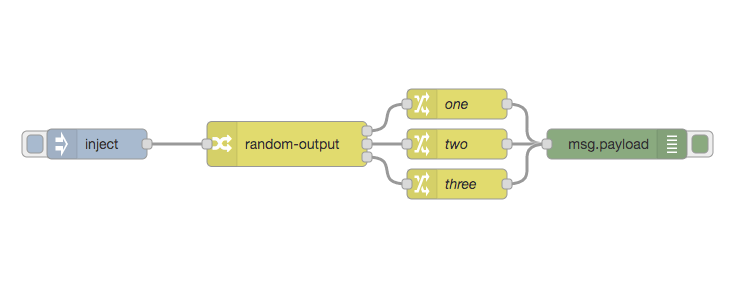

# node-red-contrib-pick-random

Routes a received msg to a random output. Number of outputs can be set in the config dialog. Optionally, weights for each output can be defined in the configuration.



## Installation

* Search for `node-red-contrib-random-output` in node-reds Pallete Manager
* or via cli: `cd ~/.node-red; npm install node-red-contrib-random-output`

## Example flow

```
[[{"id":"f7701d65.91163","type":"tab","label":"Flow 1","disabled":false,"info":""},{"id":"b3d6be0a.f271f","type":"random-output","z":"f7701d65.91163","name":"","outputs":3,"x":360,"y":240,"wires":[["5dc5f361.d77dbc"],["7297a39d.73b9fc"],["c1cb9031.c466e"]]},{"id":"521c8eca.e76ab","type":"inject","z":"f7701d65.91163","name":"","props":[],"repeat":"","crontab":"","once":false,"onceDelay":0.1,"topic":"","x":170,"y":240,"wires":[["b3d6be0a.f271f"]]},{"id":"bf43aaf1.1baf58","type":"debug","z":"f7701d65.91163","name":"","active":true,"tosidebar":true,"console":false,"tostatus":false,"complete":"false","statusVal":"","statusType":"auto","x":690,"y":240,"wires":[]},{"id":"5dc5f361.d77dbc","type":"change","z":"f7701d65.91163","name":"one","rules":[{"t":"set","p":"payload","pt":"msg","to":"one","tot":"str"}],"action":"","property":"","from":"","to":"","reg":false,"x":530,"y":200,"wires":[["bf43aaf1.1baf58"]]},{"id":"7297a39d.73b9fc","type":"change","z":"f7701d65.91163","name":"two","rules":[{"t":"set","p":"payload","pt":"msg","to":"two","tot":"str"}],"action":"","property":"","from":"","to":"","reg":false,"x":530,"y":240,"wires":[["bf43aaf1.1baf58"]]},{"id":"c1cb9031.c466e","type":"change","z":"f7701d65.91163","name":"three","rules":[{"t":"set","p":"payload","pt":"msg","to":"three","tot":"str"}],"action":"","property":"","from":"","to":"","reg":false,"x":530,"y":280,"wires":[["bf43aaf1.1baf58"]]}]](https://github.com/lutzer/node-red-contrib-random-output.git)
```